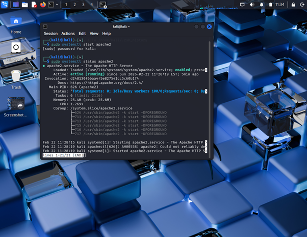
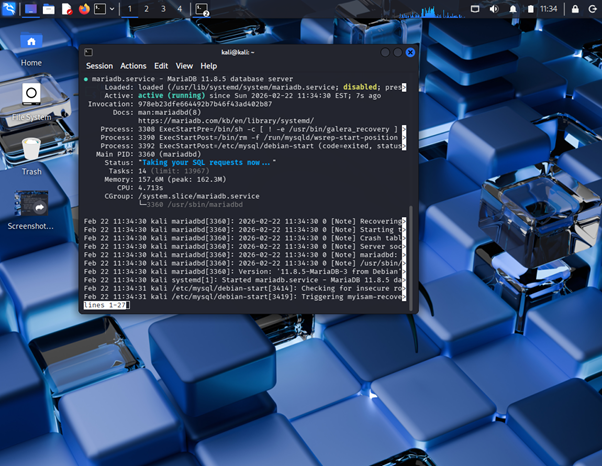
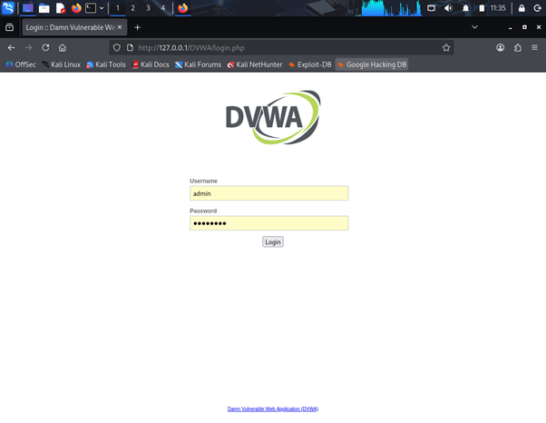

# Task 1 – DVWA Lab Setup

## ApexPlanet Cybersecurity & Ethical Hacking Internship

## Objective

The objective of this task was to set up a vulnerable web application lab environment using **DVWA (Damn Vulnerable Web Application)** inside Kali Linux.

This lab enables safe practice of web application security concepts in a controlled and isolated environment.

## Tools & Technologies Used

- Kali Linux
- Apache Web Server
- MariaDB (MySQL Database)
- PHP
- DVWA (Damn Vulnerable Web Application)
- VirtualBox

##  Lab Setup Procedure

### 1. Installed Required Services

Installed Apache, MariaDB, PHP and required dependencies inside Kali Linux.

### 2️. Downloaded DVWA
---bash
sudo git clone https://github.com/digininja/DVWA.git /var/www/html/DVWA

### 3. Configured Database

- created a database in Mariadb
- edited config.inc.php
- updated database credentials
- establishes connection between DVWA and MariaDB

### 4. Started Required Services

---bash

  sudo systemctl start apache2
  sudo systemctl start mariadb

### 5. Verified service status

---bash

   sudo systemctl status apache2
   sudo systemctl status mariadb
Both services were active and running successfully

### 6. Accessed DVWA in Browser

--> in firebox browser of kali
    http://127.0.0.1/DVWA/login.php
The DVWA login page appeared successfully confirming proper configuration

----------------------------------------------------------------------------------------------------------------------

## Screenshots :

### Apache Service Running

### MariaDB Service Running

### DVWA Login Page

-----------------------------------------------------------------------------------------------------------------------
## Video walkthrough :

Linkedin Explanation video:
👉

------------------------------------------------------------------------------------------------------------------------

## Learning Outcomes :

- Understood Linux service management  
- Configured Apache and MariaDB services  
- Established web application and database connectivity  
- Learned about vulnerable application environments  
- Built a secure private cybersecurity lab setup

------------------------------------------------------------------------------------------------------------------------
### Intern Details :
- Name : S.Tejasri
- Internship : ApexPlanet Cybersecurity & ethical hacking
- Task : Task1 -DVWA lab setup
