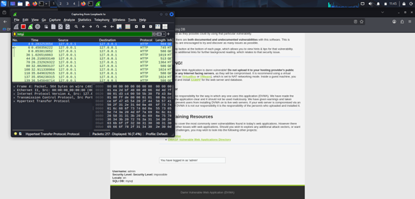
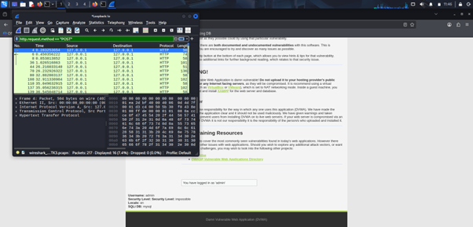
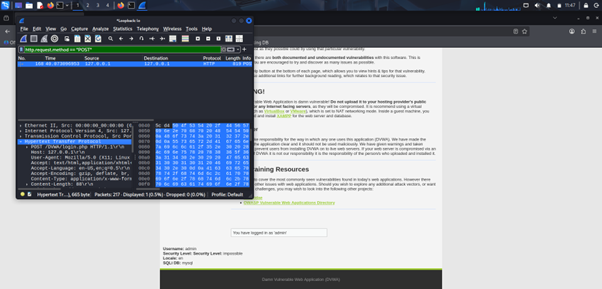
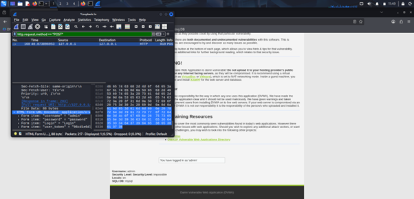

# 🔐 Task 2: Network Traffic Analysis using Wireshark

## 📌 Objective
To capture and analyze HTTP login traffic using Wireshark and demonstrate how unencrypted credentials can be intercepted over the network.

---

## 🛠 Tools Used
- Kali Linux (VirtualBox)
- Wireshark
- DVWA (Damn Vulnerable Web Application)
- Apache2 Web Server
- MariaDB

---

## 🧪 Lab Environment
- DVWA hosted locally on Kali Linux
- Accessed via: http://127.0.0.1/DVWA/login.php
- Traffic captured using Loopback interface (lo)

---

## 🚀 Procedure

### 1️⃣ Start Wireshark
- Open Wireshark.
- Select **Loopback (lo)** interface.
- Start capturing packets.

---

### 2️⃣ Apply HTTP Filter
http
This filters only HTTP traffic.

---

### 3️⃣ Login to DVWA
- Open browser.
- Navigate to:
  http://127.0.0.1/DVWA/login.php
  - Enter credentials:
- Username: admin
- Password: password
- Click Login.

---

### 4️⃣ Filter POST Requests
After login, apply:
http.request.method == "POST"
This shows only form submission packets.

---

### 5️⃣ Analyze the Packet
- Click on the POST request.
- Expand:
Hypertext Transfer Protocol -> HTML Form URL Encoded

### 🔍 Captured Credentials:
username = admin password = password

---

## 📸 Screenshots

### 🔹 HTTP Traffic Capture

### 🔹 POST Request Filter Applied

### 🔹 Credentials Visible in Plain Text

---

## 🔎 Observation

The login credentials were transmitted in plain text over HTTP.  
Wireshark successfully captured and displayed the username and password without encryption.

---

## ⚠️ Security Implication

Since HTTP does not encrypt data:
- Sensitive information can be intercepted.
- Attackers on the same network can perform packet sniffing attacks.
- HTTPS is necessary to protect login credentials.

---

## ✅ Conclusion

This task demonstrates the insecurity of unencrypted HTTP communication.  
It highlights the importance of using HTTPS to prevent credential theft through network sniffing.

---

### Video Walkthrough 
Linkedin link :
https://www.linkedin.com/posts/tejasri-somarouthu-78aa83355_cybersecurity-wireshark-nmap-activity-7431881855597096960-S-q2?utm_source=social_share_send&utm_medium=member_desktop_web&rcm=ACoAAFidKJoBRLvumfdgwfmIDItuHoJpdXkBZuI

----

## 👨‍💻 Author
Name : S.Tejasri  
Intern : Cybersecurity & Ethical Hacking Internship 
